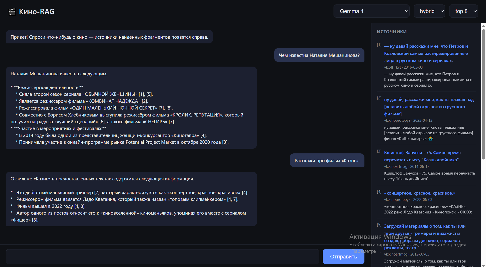
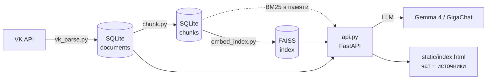

# 🎬 Кино-RAG

RAG-система для работы с постами ВКонтакте: **собрал контент → нашёл релевантные фрагменты → получил ответ со ссылками
на источники**. Источник данных — 5 VK-пабликов про кино (38k+ постов), поиск гибридный (BM25 + FAISS),
генерация — через Ollama (облачная `gemma4:cloud`) или GigaChat (на выбор), простой чат-UI поверх FastAPI.


<!-- скриншот интерфейса — чат слева, источники справа -->


## Архитектура



**Ретривер — гибридный**: BM25 (точные совпадения слов) + FAISS (семантический поиск, `paraphrase-multilingual-MiniLM-L12-v2`)
объединяются через Reciprocal Rank Fusion с весом 0.7/0.3 в пользу BM25 — на именных запросах («какой фильм у
актёра X», «фильмы режиссёра Y») маленькая embedding-модель плохо различает конкретные имена, BM25 их ловит
точно; на смысловых запросах без общих слов («фильмы про космос») лучше работает FAISS. Вместе — заметно лучше
любого из них по отдельности (см. [Оценка качества](#оценка-качества)).

## Возможности

- **Сбор**: `wall.get` VK API постранично по всей истории стены (не упирается в потолок листинга сайта/канала) — дедуп по `url` и `sha256(текст)`, инкрементальная загрузка новых пабликов
  без повторной загрузки уже собранных (`--skip-existing`).
- **Очистка текста**: разметка ВК (`[url|подпись]`), голые ссылки, хэштеги.
- **Чанкинг**: по границам предложений/абзацев, не абы как по словам; перехлёст между соседними чанками.
- **Индекс**: BM25 (без внешних зависимостей) + FAISS (локальная embedding-модель, без Ollama/GigaChat/ключей).
- **Гибридный поиск** с настраиваемым весом BM25/FAISS, фильтром по источнику (`vk:kinoprotebya` и т.п.).
- **`/ask`**: экстрактивный ответ без LLM (топ-фрагменты + источники) или генерация через Ollama/GigaChat с
  обязательным цитированием источников по номерам и честным «не нашёл» вместо выдумывания.
- **Оценка качества**: Recall@K / Hit@K через LLM-as-judge — без ручной разметки эталона.
- **UI**: простой чат (без сборки/npm, один HTML-файл) с источниками справа и живыми ссылками на посты.

## Стек

| Слой | Инструмент |
|---|---|
| Сбор данных | VK API (`requests`) |
| Хранилище | SQLite |
| Текстовый поиск | BM25 (собственная реализация) |
| Векторный поиск | FAISS + fastembed (`paraphrase-multilingual-MiniLM-L12-v2`, ONNX/CPU) |
| LLM | Ollama (облачные модели, `gemma4:cloud`) или GigaChat API |
| Backend | FastAPI + uvicorn |
| Frontend | HTML/CSS/JS, без сборки |
| Конфигурация | `.env` + `python-dotenv` |


## Структура проекта

```
config.py           # .env -> dataclass-конфиги (Ollama/GigaChat/VK)
storage.py           # схема documents + дедуп-запись
vk_parse.py          # сбор постов VK API -> documents
text_clean.py        # чистка разметки ВК/ссылок из текста поста
chunk.py             # documents -> chunks (нарезка по предложениям)
embed_index.py       # chunks -> FAISS-индекс (fastembed)
stopwords_ru.py      # стоп-слова для BM25-токенизации
search.py            # BM25 + FAISS + RRF-гибрид, переиспользуемый ретривер
ask.py               # ретривер -> контекст -> LLM (Ollama/GigaChat) или экстрактивный ответ
api.py               # FastAPI: /search, /ask, /health + статика UI
static/index.html    # чат-интерфейс (без сборки)
eval_recall.py       # Recall@K/Hit@K через LLM-as-judge
run_prompts.py       # массовый прогон списка промптов через ask.answer()
clean_existing.py    # ретроактивная чистка текста в уже собранных documents
```


Полный список флагов — `python <скрипт>.py --help`.

## Оценка качества

`eval_recall.py` считает Recall@K/Hit@K без ручной разметки эталона: для каждого тестового вопроса берётся пул
из топ-10 кандидатов ретривера, LLM-судья (та же модель Ollama) размечает каждый фрагмент как релевантный или
нет с коротким обоснованием — так метрику можно выборочно перепроверить по JSON-выгрузке.

Результат на 20 тестовых вопросах (конкретные факты о российском кино — режиссёры, награды, актёры, сюжеты):

| K | Hit rate | Mean Recall |
|---|---|---|
| 1 | 0.30 | 0.19 |
| 3 | 0.55 | 0.41 |
| 5 | 0.65 | 0.60 |
| **8 (дефолт `/ask`)** | **0.70** | **0.83** |
| 10 | 0.75 | 1.00 |

`top_k=8` выбран по этим данным: заметный прирост полноты относительно `top_k=5` за разумную цену (3
дополнительных чанка в контексте). 25% вопросов (5 из 20) не находят релевантный фрагмент даже в пуле из 10 —
это не промах ретривера, а честная дыра в покрытии корпуса (см. ниже).

## Известные ограничения

- **Покрытие корпуса.** 5 выбранных каналов больше про фестивальное/артхаусное кино и киножурналистику, поэтому
  в них не найти пресс-релизы с полными данными по мейнстрим-блокбастерам (актёрский состав, продюсеры) — на части
  вопросов система честно отвечает «не нашёл», потому что факта в источниках нет.
- **Маленькая embedding-модель** (384-мерная, ~225 МБ) слабо различает конкретные имена собственные — отдельно
  FAISS проигрывает BM25 на именных запросах; гибрид с весом 0.7 в пользу BM25 компенсирует это на практике.
- **LLM-as-judge.** Метрики Recall@K получены при помощи LLM, без ручной разметки.

